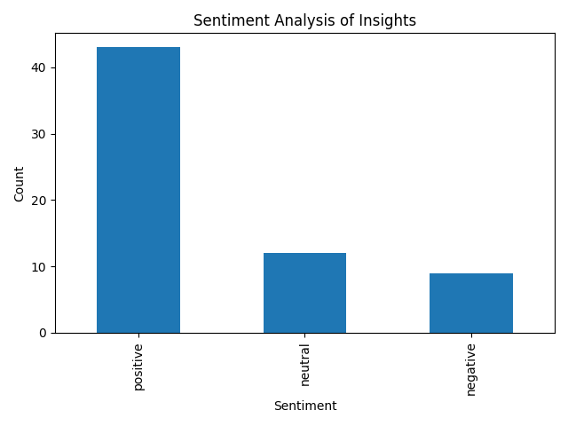

# Descpription about code files

## File Structure

- `download.py`: Script to download 10-K filings using SEC_EDGAR API (Apple, Google, and Microsoft selected for this example)
- `analyze_cohere.py`: Script for preprocessing, generating insights, and analyzing sentiment.
- `app.py`: Streamlit application for visualizing insights and sentiment.
- `insights.csv`: Extracted insights from LLM

1) The Selected Finances, Management Discussion & Analysis, and Financial Statement sections are chosen from the 10-K filing data because they provide key financial information, strategic insights, and a detailed analysis of the company's performance, risks, and future outlook, which are crucial for understanding the company's financial health and making informed investment decisions.
2) Sentiment of insights were visualized to understand the bullish and bearish behavior of the company's revenue.

## Sample Visual

